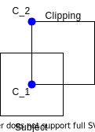
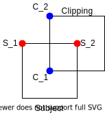
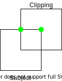
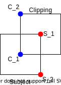
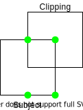

# Sutherland–Hodgman
 A NumPy and PyTorch implementation of the Sutherland–Hodgman algorithm for clipping convex and non-convex polygons in 2D. The difference between the two implementations is that the PyTorch implementation is [differentiable](https://en.wikipedia.org/wiki/Automatic_differentiation). For example, this allows using the Sutherland-Hodgman algorithm to implement the [Generalized Intersection over Union](https://openaccess.thecvf.com/content_CVPR_2019/html/Rezatofighi_Generalized_Intersection_Over_Union_A_Metric_and_a_Loss_for_CVPR_2019_paper.html) metric for the case of more complex bounding polygons. Additionally, either implementation of the Sutherland-Hodgman algorithm, together with the [shoelace algorithm](https://en.wikipedia.org/wiki/Shoelace_formula), can be used to compute the area of intersection of two or more polygons in 2D.

## Usage

**NumPy**

```python
import numpy as np
from SH import PolygonClipper

subject_polygon = np.array([[-1,1],[1,1],[1,-1],[-1,-1]])
clipping_polygon = np.array([[0,0],[0,2],[2,2],[2,0]])

clip = PolygonClipper(warn_if_empty = False)

clipped_polygon = clip(subject_polygon,clipping_polygon)
```

Make sure that the vertices in `subject_polygon` and `clipping_polygon` are [arranged in clockwise order](https://stackoverflow.com/questions/1165647/how-to-determine-if-a-list-of-polygon-points-are-in-clockwise-order/1180256). If `warn_if_empty = True`, then you will get a warning if no intersections were found.

 **PyTorch**

```python
import torch
from SH_diff import PolygonClipper

subject_polygon = torch.tensor([[-1.,1.],[1.,1.],[1.,-1.],[-1.,-1.]])
clipping_polygon = torch.tensor([[0.,0.],[0.,2.],[2.,2.],[2.,0.]],requires_grad=True)

clip = PolygonClipper(warn_if_empty = False)

clipped_polygon = clip(subject_polygon,clipping_polygon)
```

It is assumed that `clipping_polygon` has `requires_grad = True` only. Make sure that the vertices in `subject_polygon` and `clipping_polygon` are [arranged in clockwise order](https://stackoverflow.com/questions/1165647/how-to-determine-if-a-list-of-polygon-points-are-in-clockwise-order/1180256). If `warn_if_empty = True`, then you will get a warning if no intersections were found.

## Explanation

The following explanation of the Sutherland-Hodgman algorithm applies to both the NumPy and PyTorch implementations. Given a `N x 2` array containing the vertices of a subject polygon that are [arranged in clockwise order](https://stackoverflow.com/questions/1165647/how-to-determine-if-a-list-of-polygon-points-are-in-clockwise-order/1180256):

```python
S = np.array([[x_1,y_1],
              [x_2,y_2],
              ...,
              [x_N,y_N]])
```

and given a `M x 2` array containing the vertices of a clipping polygon that are arranged in clockwise order:

```python
C = np.array([[x_1,y_1],
              [x_2,y_2],
              ...,
              [x_M,y_M]])
```

For example, suppose that the subject polygon `S` and the clipping polygon `C` are:

<p align="center"></p>
<p align="center"><b>Figure 1</b></p>

The first step of the Sutherland-Hodgman algorithm is to pick the first two vertices defined in the `C` array. These are the blue points marked as `C_1` and `C_2` respectively  in figure 2.

<p align="center"></p>
<p align="center"><b>Figure 2</b></p>

The next step is to pick the first two vertices defined in the `S` array. These are the red points marked as `S_1` and `S_2` respectively in figure 3:

<p align="center"></p>
<p align="center"><b>Figure 3</b></p>

We then want to check if the red points are inside the clipping polygon. Since the vertices that define the clipping polygon in the `C` array are arranged in clockwise order, then we can check if the red points are inside the clipping polygon by checking that the red points are "to the right" of the line connecting the blue points. Given any two points `A` and `B`, which are defined by the coordinates `(A_x,A_y)` and `(B_x,B_y)` respectively, and a third point `P` defined by the coordinates `(P_x,P_y)`, which are shown in figure 4,

<p align="center"></p>
<p align="center"><b>Figure 4</b></p>

we can check if the point `P` is to the right of the line connecting points `A` and `B` by computing:

```
R = (P_x - A_x) * (B_y - A_y) - (P_y - A_y) * (B_x - A_x)
```

If `R < 0`, then the point `P` is to the right of the line connecting points `A` and `B`, and if `R > 0`, then the point `P` is to the left. If `R = 0`, then the point `P` is on the line. For more information about this method, see [this answer](https://math.stackexchange.com/a/274728/652310).

In figure 3, the point `S_1` is to the left of the line connecting points `C_1` and `C_2`, while the point `S_2` is to the right of this line. Since we are performing polygon clipping, we want to discard point `S_1`, save the point of intersection between the line connecting points `S_1` and `S_2` and the line connecting points `C_1` and `C_2`, and save point `S_2`. Visually, we would save the green points marked in figure 5.

<p align="center"></p>
<p align="center"><b>Figure 5</b></p>

More generally, we would apply the following rules:

* if points `S_1` and `S_2` are to the right of the line connecting points `C_1` and `C_2`, then save point `S_2`.
* if point `S_1` is to the left and point `S_2` is to the right, then save the point of intersection between the two lines and then save point `S_2`.
* if point `S_1` is to the right and point `S_2` is to the left, then only save the the point of intersection between the two lines.
* if points `S_1` and `S_2` are to the left, then neither are saved.

Next, we would choose the next two points in the subject polygon, which are marked in red in figure 6.

<p align="center"></p>
<p align="center"><b>Figure 6</b></p>

We can then repeat this entire procedure for all pairs of consecutive points in the subject polygon to get the saved points marked in green in figure 7.

<p align="center"></p>
<p align="center"><b>Figure 7</b></p>

Afterwards, we would repeat this procedure for all pairs of consecutive points in the clipping polygon, where the saved points from the previous iteration are treated as the coordinates of the subject polygon in the next iteration.

The pseudocode for the Sutherland-Hodgman algorithm is shown below:

```
INPUT:
S = np.array([[x_1,y_1],
              [x_2,y_2],
              ...,
              [x_N,y_N]])
C = np.array([[x_1,y_1],
              [x_2,y_2],
              ...,
              [x_M,y_M]])

CODE:

# create a copy of the S array
output = copy(S)

for i = 1 to M:
	# to save the vertices of the new (clipped) subject polygon
    next_S = copy(output)
    
    # stores the vertices of the final clipped polygon
    output = []
    
    # these two vertices define a line segment (edge) in the clipping
    # polygon. It is assumed that indices wrap around, such that if
    # i = 0, then i - 1 = M.
    c_vertex1 = C[i]
    c_vertex2 = C[i - 1]
    
    for j = 1 to N:
    	
    	# these two vertices define a line segment (edge) in the subject
        # polygon. It is assumed that indices wrap around, such that if
        # j = 0, then j - 1 = N.
        s_vertex1 = next_S[j]
        s_vertex2 = next_S[j - 1]
        
        if s_vertex2 is to the right of the line connecting c_vertex1 to c_vertex2:
        	if s_vertex1 is to the left of the line connecting c_vertex1 to c_vertex2:
        		intersection_point = compute_intersection(s_vertex1,s_vertex2,c_vertex1,c_vertex2)
        		output.append(intersection_point)
        	output.append(s_vertex2)
        else if s_vertex1 is to the right of the line connecting c_vertex1 to c_vertex2:
        	intersection_point = compute_intersection(s_vertex1,s_vertex2,c_vertex1,c_vertex2)
        	output.append(intersection_point)

return output
```

where the `compute_intersection` function is used to compute the point of intersection of the line connecting the points `s_vertex1` and `s_vertex2` and the line connecting the points `c_vertex1` and `c_vertex2`.
